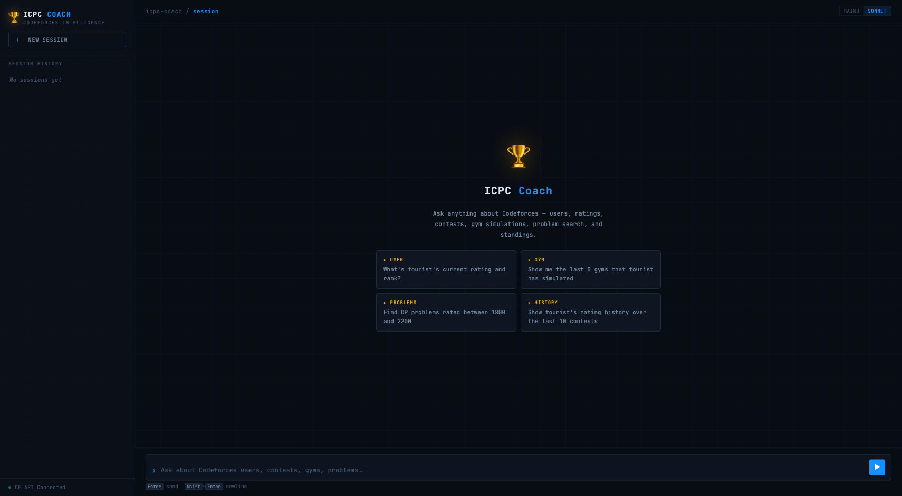
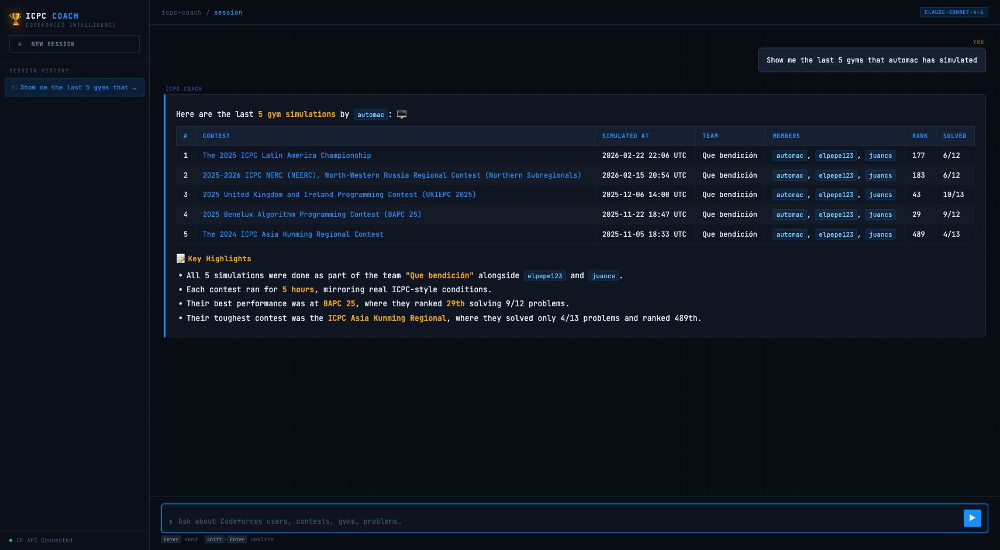

# 🏆 ICPC Coach Agent

An AI-powered chat interface for querying [Codeforces](https://codeforces.com) data in natural language. Ask questions like *"Show me the last 5 gyms automac has simulated"* and get back rich, formatted answers with standings, problem counts, ratings, and more.

Built with the [Claude API](https://anthropic.com) (tool use + streaming) and the Codeforces REST API.

---

## Screenshots





---

## Features

- **Natural language queries** — ask anything about users, contests, problems, or standings
- **Gym simulation tracking** — finds real virtual simulations (not upsolving), shows rank, solved count, difficulty, and team members
- **Streaming responses** — text streams token-by-token as Claude generates it
- **Markdown rendering** — tables, code blocks, bullet lists, syntax-highlighted code
- **Session history** — sidebar keeps past questions; click any to restore the conversation
- **Model switcher** — toggle between Haiku (fast, default) and Sonnet (more capable) in the UI

### Example queries

| Category | Example |
|---|---|
| User profile | `What's tourist's current rating and rank?` |
| Gym simulations | `Show me the last 5 gyms automac has simulated` |
| Problem search | `Find DP problems rated between 1800 and 2200` |
| Standings | `Who are the top 10 in contest 2035?` |
| Rating history | `Show tourist's rating history over the last 10 contests` |

---

## Stack

- **Backend** — Node.js + Express, SSE streaming
- **AI** — `@anthropic-ai/sdk` with tool use and streaming
- **Frontend** — Vanilla HTML/CSS/JS (no build step), single file
- **Markdown** — marked.js v9 + highlight.js

---

## Setup

### Prerequisites

- Node.js 18+
- A [Codeforces API key](https://codeforces.com/settings/api)
- An [Anthropic API key](https://console.anthropic.com)

### Install

```bash
git clone <repo-url>
cd icpc-coach-agent
npm install
```

### Configure

Create a `.env` file in the project root:

```env
CODEFORCES_API_KEY=your_cf_api_key
CODEFORCES_API_SECRET=your_cf_api_secret
ANTHROPIC_API_KEY=sk-ant-...
```

> Get your Codeforces API credentials at [codeforces.com/settings/api](https://codeforces.com/settings/api).

### Run

```bash
npm start          # production
npm run dev        # auto-restart on file changes
```

Open [http://localhost:3000](http://localhost:3000).

---

## Project structure

```
icpc-coach-agent/
├── server.js              # Express app — serves UI, handles POST /api/chat
├── src/
│   ├── agent.js           # Claude agent: tool definitions, agentic loop, gym logic
│   └── codeforces.js      # CF API client: auth, rate limiting, all endpoints
├── public/
│   └── index.html         # Single-file frontend (HTML + CSS + JS)
├── ARCHITECTURE.md        # Deep-dive on how everything works
└── .env                   # Secrets (not committed)
```

See [ARCHITECTURE.md](ARCHITECTURE.md) for a detailed breakdown of the implementation.

---

## How it works (brief)

1. You type a question and hit Enter
2. The frontend POSTs `{ messages, model }` to `/api/chat`
3. The server runs a Claude agent loop:
   - Claude picks the right Codeforces tool(s) to call
   - The server executes the CF API calls and feeds results back to Claude
   - This repeats until Claude has enough data to answer
4. Claude's answer streams back as SSE text deltas, rendered as Markdown in real time

For gym simulation queries specifically, the server does all the heavy lifting (scanning submissions, resolving contest names, fetching standings) and returns a compact result to Claude — avoiding the token budget issues that would arise from sending raw bulk data to the model.

---

## Environment variables

| Variable | Required | Description |
|---|---|---|
| `ANTHROPIC_API_KEY` | ✅ | Your Anthropic API key |
| `CODEFORCES_API_KEY` | ✅ | Codeforces API key |
| `CODEFORCES_API_SECRET` | ✅ | Codeforces API secret |
| `PORT` | optional | Server port (default: `3000`) |
